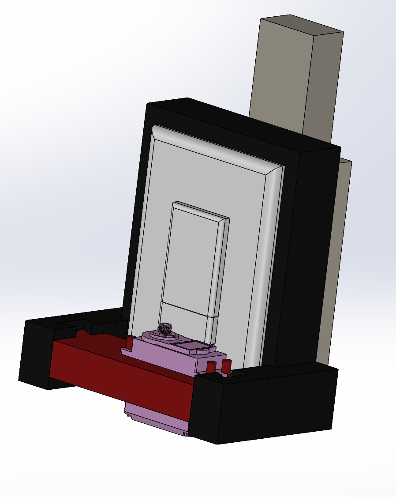

# Pi Remote Light Switch

This project uses a Raspberry Pi and a motor to remotely control a physical light switch. The system is housed in a custom 3D-printed casing and is controlled via a web interface.

## Features

* **Remote Control:** Toggle a light switch from a web browser.
* **3D-Printed Casing:** A custom-designed case to house the Raspberry Pi and motor, mounted over the light switch.
* **Motorized Action:** A servo or stepper motor physically flips the switch.

---

## Hardware

* **Raspberry Pi:** Raspberry Pi 4 Model B
* **Motor:**  MG995 servo motor
* **3D-Printed Parts:**
    * Main Casing
    * Motor Mount
* **Power Supply:** (e.g., 5V USB-C for the Pi)
* **Jumper Wires**

*(You would add your `.stl` or other 3D model files to a folder in this repository, perhaps named `3d-models/`)*

---
## 3D Print

---
## Software & Code

This project is built in two main parts:

### 1. Web Application (Laravel)

The web interface is built using the Laravel PHP framework.

* **Framework:** Laravel
* **Key Files:**
    * `routes/web.php`: Defines the web routes (e.g., `/light/on`, `/light/off`) that trigger the action.
    * `app/Http/Controllers/LightController.php`: The controller that handles the web request and executes the Python script.
    * `resources/views/welcome.blade.php`: The simple web page with buttons to control the light.

### 2. Raspberry Pi Script (Python)

A Python script on the Raspberry Pi controls the motor connected to the GPIO pins.

* **Language:** Python
* **Key Libraries:**
    * `RPi.GPIO`: Used to control the Raspberry Pi's GPIO pins.
    * `time`: Used for delays to manage the motor's movement.
* **Script:** `motor_control.py` (This is an example name)
    * The script accepts arguments (e.g., `on` or `off`).
    * It activates the motor, rotating it to the correct position to flip the switch.
    * The Laravel application calls this script using a function like `shell_exec()`.

---

## Installation & Setup

### Option 1: Deploy to Railway.app (Cloud Hosting)

Deploy the web interface to Railway for public access, then connect it to your Raspberry Pi.

1. **Create a Railway Account:**
   * Go to [Railway.app](https://railway.app) and sign up with your GitHub account

2. **Deploy from GitHub:**
   * Click "New Project" → "Deploy from GitHub repo"
   * Select this repository (`pi-remote-light`)
   * Railway will automatically detect Laravel and deploy it

3. **Configure Environment Variables:**
   * In Railway dashboard, go to your project → Variables
   * Click "Add Variable" and set:
     * `APP_KEY`: Run `php artisan key:generate --show` locally and copy the key
     * `APP_ENV`: `production`
     * `APP_DEBUG`: `false`
     * `APP_URL`: Your Railway app URL (e.g., `https://your-app.railway.app`)
   * Railway automatically handles the database (SQLite works out of the box)

4. **Generate Domain:**
   * In Railway dashboard, go to Settings → Networking
   * Click "Generate Domain" to get your public URL

5. **Connect to Your Raspberry Pi:**
   * Configure the web app to communicate with your Pi via webhooks/API
   * Or use ngrok on your Pi to expose the GPIO control endpoint

### Option 2: Local Setup on Raspberry Pi

Run the entire application on your Raspberry Pi for local or LAN access.

1.  **3D Print:** Print all the components from the `3d-models/` directory.
2.  **Assemble Hardware:** Mount the Raspberry Pi and motor in the casing as designed.
3.  **Deploy Web App:**
    * Clone this repository onto your Raspberry Pi: `git clone https://github.com/casperadamus/pi-remote-light.git`
    * Install PHP, Composer, and a web server (like Nginx or Caddy).
    * Navigate to the project directory: `cd pi-remote-light`
    * Install dependencies: `composer install`
    * Set up your environment: `cp .env.example .env` and then `php artisan key:generate`
    * Create database: `touch database/database.sqlite` and run `php artisan migrate`
    * Configure your web server to point to the `public/` directory.
4.  **Setup Python Script:**
    * Make sure your Python script (e.g., `motor_control.py`) is executable: `chmod +x motor_control.py`
    * Ensure the web server user (e.g., `www-data`) has permission to execute the script and access GPIO pins.
5.  **Expose Publicly (Optional):**
    * Install ngrok: `snap install ngrok` or download from [ngrok.com](https://ngrok.com)
    * Run: `ngrok http 8000`
    * Share the generated URL for public access
